<div align="center">

# 🔮 AI Ops — Monitoring & Alerting Platform

**Production-grade backend for real-time service monitoring, intelligent alert generation, and incident lifecycle management.**

[](https://www.python.org/)
[](https://www.djangoproject.com/)
[](https://www.django-rest-framework.org/)
[](https://www.postgresql.org/)
[](https://redis.io/)
[](https://docs.celeryq.dev/)
[](https://www.docker.com/)
[](https://railway.app/)
[](https://resend.com/)
[](LICENSE)

</div>

---

## 📖 Project Overview

**AI Ops** is a backend platform built with Django REST Framework that provides centralized monitoring and alerting for distributed services. It ingests structured logs from monitored services, automatically evaluates alert rules against incoming data, generates alerts with severity classification, and dispatches notifications through configurable channels.

The platform is deployed to **Railway** with PostgreSQL, Redis, Celery Worker, and Celery Beat as separate managed services. Production email delivery is powered by **Resend**.

### Business Problem

Modern infrastructure teams need a single pane of glass to monitor service health, detect anomalies, and manage incidents from detection through resolution. AI Ops provides:

- **Log Ingestion** — Centralized collection of monitoring logs from any service.
- **Automated Alert Generation** — Rule-based alert engine that detects errors and high-latency conditions.
- **Incident Lifecycle Management** — Structured workflow for acknowledging and resolving alerts.
- **Notification Dispatch** — Asynchronous email notifications via Resend API with Slack placeholder for future expansion.
- **Scheduled Cleanup** — Automated retention policies to prevent database bloat.

### High-Level Architecture

```
Client → DRF API → Views → Service Layer → Models/Database
                      ↓
               Celery Worker → Alert Engine → Notification Service → Email Service → Resend API
                      ↑
               Celery Beat → Scheduled Cleanup Tasks
                      ↑
                    Redis (Broker + Result Backend)
```

---

## 🌐 Live Deployment

The production instance is live on **Railway**:

> **Base URL:** `https://ai-ops-production-himanshu26.up.railway.app`

| Endpoint | Live URL |
|----------|----------|
| Health Check | [`/api/v1/health/`](https://ai-ops-production-himanshu26.up.railway.app/api/v1/health/) |
| Swagger UI | [`/api/v1/docs/`](https://ai-ops-production-himanshu26.up.railway.app/api/v1/docs/) |
| ReDoc | [`/api/v1/docs/redoc/`](https://ai-ops-production-himanshu26.up.railway.app/api/v1/docs/redoc/) |
| OpenAPI Schema | [`/api/v1/schema/`](https://ai-ops-production-himanshu26.up.railway.app/api/v1/schema/) |
| Accounts API | [`/api/v1/accounts/`](https://ai-ops-production-himanshu26.up.railway.app/api/v1/accounts/) |
| Monitoring API | [`/api/v1/monitoring/`](https://ai-ops-production-himanshu26.up.railway.app/api/v1/monitoring/) |
| Alerts API | [`/api/v1/alerts/`](https://ai-ops-production-himanshu26.up.railway.app/api/v1/alerts/) |
| Admin Panel | [`/admin/`](https://ai-ops-production-himanshu26.up.railway.app/admin/) |

---

## 📌 Project Status

The following capabilities are implemented and operational:

| Capability | Status |
|------------|:------:|
| Docker Support | ✅ |
| Docker Compose (Development) | ✅ |
| Docker Compose (Production) | ✅ |
| PostgreSQL | ✅ |
| Redis | ✅ |
| Celery | ✅ |
| Celery Beat | ✅ |
| Health Check API | ✅ |
| Production-ready Docker Health Checks | ✅ |
| JWT Authentication | ✅ |
| Google OAuth 2.0 | ✅ |
| Email Verification | ✅ |
| Password Reset | ✅ |
| Refresh Tokens | ✅ |
| Logout | ✅ |
| Alert Engine | ✅ |
| Background Notifications (Resend) | ✅ |
| Cursor Pagination | ✅ |
| Advanced Filtering | ✅ |
| Swagger / OpenAPI | ✅ |
| Railway Deployment | ✅ |
| WhiteNoise Static Files | ✅ |
| Production Logging | ✅ |
| Django REST Framework | ✅ |
| Environment Configuration | ✅ |
| Custom User Model | ✅ |
| Production-grade Project Structure | ✅ |
| Comprehensive Test Suite (pytest) | ✅ |
| Factory-based Test Data (factory_boy) | ✅ |
| Unit Tests | ✅ |
| API Tests | ✅ |
| Integration Tests | ✅ |
| Code Coverage Reporting | ✅ |

---

## 📚 Documentation

The project includes comprehensive documentation resources:
- **API Documentation** — Swagger UI, ReDoc, OpenAPI Schema
- **Postman Collection** — Ready-to-import API collection
- **Architecture Diagrams** — System architecture, database schema, request flow
- **Testing Documentation** — Screenshots of test execution and coverage reports
- **Testing Reports** — Text-based pytest and coverage output

Documentation structure:
```
docs/
├── api/                  # OpenAPI schema (YAML)
├── architecture/         # Architecture diagrams
├── postman/              # Postman collection
├── screenshots/          # Application screenshots
├── testing/              # Testing screenshots (unit, API, integration, coverage)
└── testing_reports/      # Text-based pytest and coverage reports
```

---

## 🗂️ Documentation Assets

| Asset | Location |
|-------|----------|
| Swagger UI | `/api/v1/docs/` |
| ReDoc | `/api/v1/docs/redoc/` |
| OpenAPI Schema | `/api/v1/schema/` |
| OpenAPI YAML | `docs/api/openapi.yaml` |
| Architecture | `docs/architecture/` |
| Screenshots | `docs/screenshots/` |
| Postman Collection | `docs/postman/` |
| Testing Screenshots | `docs/testing/` |
| Testing Reports | `docs/testing_reports/` |
| Docker Compose (Dev) | `docker-compose.dev.yml` |
| Docker Compose (Prod) | `docker-compose.prod.yml` |

---

## 🐳 Docker Support

AI Ops can run entirely using Docker Compose — no local Python, PostgreSQL, or Redis installation required.

### Containers

| Container | Image | Purpose |
|-----------|-------|---------|
| `ai_ops_web` | Custom (Dockerfile) | Django development server / Gunicorn (prod) |
| `ai_ops_db` | `postgres:16-alpine` | PostgreSQL database |
| `ai_ops_redis` | `redis:7-alpine` | Celery broker & result backend |
| `ai_ops_celery` | Custom (Dockerfile) | Celery async worker |
| `ai_ops_celery_beat` | Custom (Dockerfile) | Celery periodic task scheduler |

### Files

| File | Purpose |
|------|---------|
| `Dockerfile` | Production-grade image (Python 3.13-slim, Gunicorn, non-root user) |
| `docker-compose.dev.yml` | Development stack (runserver, hot-reload via volume mount) |
| `docker-compose.prod.yml` | Production stack (Gunicorn, no source volume mount) |
| `.dockerignore` | Excludes `.git`, `venv`, `.env`, IDE files from the build context |

### Quick Start (Development)

```bash
# Build and start all services
docker compose -f docker-compose.dev.yml up --build

# Start services (without rebuilding)
docker compose -f docker-compose.dev.yml up

# Stop all services
docker compose -f docker-compose.dev.yml down

# Stop and remove volumes (full reset — destroys database data)
docker compose -f docker-compose.dev.yml down -v
```

### Quick Start (Production)

```bash
# Build and start all services
docker compose -f docker-compose.prod.yml up --build -d

# Stop all services
docker compose -f docker-compose.prod.yml down
```

> **Note:** The development compose file mounts the project directory as a volume (`.:/app`) for live code reloading. The production compose file does **not** mount source volumes — it uses the baked-in image. Production compose includes persistent volumes for static files (`static_volume`) and media (`media_volume`).

### Docker Health Checks

All infrastructure containers include production-ready health checks:

| Container | Health Check | Interval |
|-----------|-------------|---------|
| PostgreSQL | `pg_isready` | 10s |
| Redis | `redis-cli ping` | 10s |
| Django | `GET /api/v1/health/` (HTTP 200) | 30s |

Django and Celery services wait for `db` and `redis` to be healthy (`condition: service_healthy`) before starting.

### Docker Features

- **Dockerfile** — Production-grade image with Python 3.13-slim, Gunicorn, non-root `appuser`, OCI labels, and layer caching optimization
- **docker-compose.dev.yml** — Development stack with hot reloading via volume mount
- **docker-compose.prod.yml** — Production stack with Gunicorn, static/media volumes, and restart policies
- **PostgreSQL** — `postgres:16-alpine` with persistent volume and `pg_isready` health check
- **Redis** — `redis:7-alpine` with `redis-cli ping` health check
- **Celery Worker** — Asynchronous task processing with graceful shutdown (`stop_grace_period: 30s`)
- **Celery Beat** — Scheduled background tasks with graceful shutdown (`stop_grace_period: 30s`)
- **Health Checks** — HTTP-based health probes on Django via `/api/v1/health/`
- **Non-root container** — Enhances security by running as `appuser`
- **Restart policies** — `unless-stopped` on all services
- **Environment variable support** — Fully configurable via `.env.dev` and `.env.prod` files
- **Network isolation** — All services communicate over a dedicated `ai_ops_network` bridge

---

## ✨ Key Features

### 🚀 API & Infrastructure

- ✔ Dockerized deployment (development & production)
- ✔ Railway cloud deployment
- ✔ Health monitoring endpoint
- ✔ Swagger / ReDoc / OpenAPI 3.0
- ✔ Postman Collection & Environment
- ✔ Celery asynchronous task processing
- ✔ Celery Beat periodic scheduling
- ✔ Redis broker & result backend
- ✔ PostgreSQL primary database
- ✔ Docker health checks
- ✔ Production Dockerfile (Gunicorn, non-root user)
- ✔ WhiteNoise static file serving
- ✔ Structured production logging
- ✔ MIT License

### 🔐 Authentication & Authorization

- **Custom User Model** — Email-based authentication (no username field)
- **JWT Authentication** — Access tokens (15 min) and refresh tokens (7 days) via SimpleJWT
- **Session-Based Token Management** — Each login creates a DB-tracked session with hashed refresh tokens
- **Google OAuth 2.0 Login** — Full Google Sign-In flow with token verification, automatic user provisioning, and internal JWT issuance
- **Email Verification** — Mandatory email verification with secure hashed tokens (24-hour expiry)
- **Password Reset** — Token-based password reset with hashed tokens (30-minute expiry), invalidates all sessions on reset
- **Logout** — Soft session deactivation preserving audit history

### 📊 Monitoring

- **Log Ingestion API** — Create, list, and retrieve structured monitoring log entries
- **Service Model** — Track registered services with status (`active`, `down`, `maintenance`), slug generation, and soft delete
- **Structured Log Data** — Status, severity, HTTP status code, response time (ms), message, and JSON metadata per log entry
- **Cursor Pagination** — Efficient cursor-based pagination for time-series log data
- **Advanced Filtering** — Filter by service, status, status code, time range, response time range, and message text
- **Ordering** — Sort by `created_at` or `response_time_ms`

### 🚨 Alert Engine

- **Automated Alert Generation** — Logs are evaluated against alert rules via Celery background tasks
- **Error Detection** — Triggers on error status or HTTP 5xx status codes
- **High Latency Detection** — Triggers when response time exceeds 1000ms threshold
- **Severity Classification** — Automatic severity assignment (`low`, `medium`, `high`, `critical`) based on status code and latency buckets
- **Alert Deduplication** — Unique constraint per service + type + alert key prevents duplicate active alerts
- **Cooldown Window** — 30-second cooldown prevents alert flooding
- **Trigger Count Tracking** — Atomic counter increments on repeated alert triggers
- **Race Condition Recovery** — IntegrityError fallback with row-level locking (`SELECT FOR UPDATE`)
- **Alert Lifecycle** — `open` → `acknowledged` → `resolved` workflow with resolution notes
- **Immutable Incident Records** — Alerts are treated as append-only; no generic update/delete operations

### 📨 Notification System

The notification system follows a clean, layered architecture:

```
Alert Created/Updated
        ↓
  Celery Task (dispatch_alert_notifications_task)
        ↓
  Notification Service (orchestrator)
        ↓
  Email Service (provider)
        ↓
  Resend API (delivery)
```

- **Asynchronous Notifications** — Alert notifications are dispatched asynchronously via Celery background tasks
- **Notification Service Layer** — Provider-isolated orchestration with per-provider error handling; provider failures never interrupt alert processing
- **Resend Email Delivery** — Production email delivery powered by the Resend API (`resend` Python SDK)
- **HTML Email Templates** — Professional HTML template (`alert_created.html`) and plain-text fallback (`alert_created.txt`) for alert notifications
- **Feature Flags** — `EMAIL_NOTIFICATIONS_ENABLED` and `SLACK_NOTIFICATIONS_ENABLED` toggle notification channels independently
- **Slack Placeholder** — Structured placeholder ready for Slack Incoming Webhooks integration
- **Transaction Safety** — Notification tasks are dispatched via `transaction.on_commit()` to ensure alerts exist in the database before workers process them

#### Notification Screenshots

**Email Verification Notification**

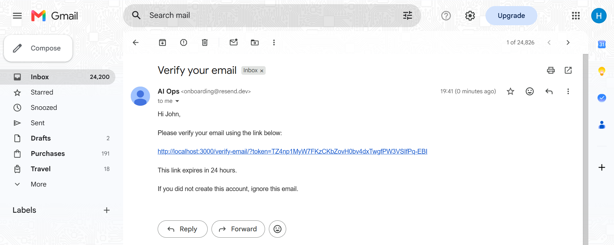

**High Latency Alert Notification**

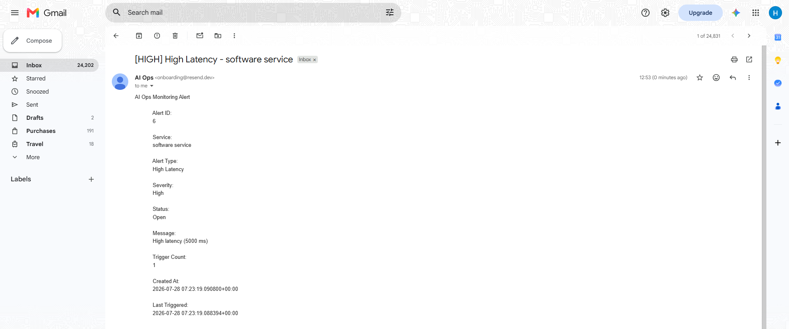

**Critical Error Alert Notification**


### 🧹 Cleanup Services

- **Accounts Cleanup** — Hourly scheduled task: expired email verification tokens, expired password reset tokens, inactive sessions (90-day retention)
- **Monitoring Cleanup** — Daily scheduled task (3 AM): monitoring logs older than 120 days
- **Alerts Cleanup** — Daily scheduled task (4 AM): resolved alerts older than 90 days

### 🏥 Health Monitoring

- **Health Check Endpoint** — `GET /api/v1/health/` with comprehensive subsystem verification
- **Application Check** — Verifies the Django process is alive
- **Database Check** — Executes `SELECT 1` against PostgreSQL via Django's connection pool
- **Redis Check** — Direct `PING` against the Redis broker
- **Celery Check** — Broker connectivity test + worker discovery via `inspect().ping()`
- **Celery Beat Check** — Structured placeholder (extensible via Redis heartbeat)
- **Metadata** — Environment, Django version, hostname, API version, uptime, response time
- **Unauthenticated** — Accessible without credentials for orchestrator probes (Docker, Railway, load balancers)

### 📦 Static File Serving

- **WhiteNoise** — Production static file serving via `whitenoise.middleware.WhiteNoiseMiddleware`
- **Compressed Manifests** — `CompressedManifestStaticFilesStorage` for cache-busting and Gzip/Brotli compression
- **Build-Time Collection** — `collectstatic` runs during Docker image build so the container is ready to serve static files immediately on startup

### 📋 Structured Logging

AI Ops uses Django's structured logging framework with a standardized format:

```
[2026-07-20 10:30:00] INFO monitoring: Starting alert processing for log 42
```

| Logger | Level | Propagate | Purpose |
|--------|-------|-----------|---------|
| `root` | INFO | — | Catch-all |
| `django` | INFO | No | Django framework logs |
| `ai_ops` | INFO | No | Application-wide logs |
| `monitoring` | INFO | No | Log ingestion and alert engine |
| `alerts` | INFO | No | Alert lifecycle and notifications |

**What Gets Logged:**

- User registration, login, logout, email verification
- Alert rule evaluation (matching rules, cooldown skips, create/update decisions)
- Notification dispatch (email sent/failed via Resend, Slack placeholder)
- Cleanup task execution (deleted token / session / log / alert counts)
- Race condition recovery (IntegrityError fallbacks)
- Celery task start/finish with log and alert IDs

### 🐳 Dockerized Environment

- **Dockerfile** — Production-grade image with Python 3.13-slim, Gunicorn, non-root user, layer caching
- **Docker Compose (Dev)** — Full development stack with hot-reload via volume mount
- **Docker Compose (Prod)** — Production-ready stack with Gunicorn and baked-in image
- **PostgreSQL Container** — `postgres:16-alpine` with persistent volume and `pg_isready` health check
- **Redis Container** — `redis:7-alpine` with `redis-cli ping` health check
- **Celery Worker Container** — Async task processing with graceful shutdown
- **Celery Beat Container** — Periodic task scheduling with graceful shutdown
- **Docker Health Checks** — HTTP-based health probes on the Django container via `/api/v1/health/`

---

## 🏗️ Architecture

### Overall Architecture

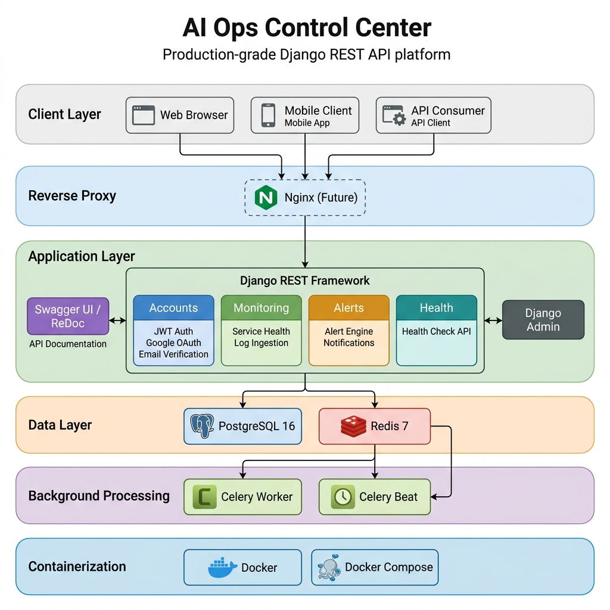

### Database Schema

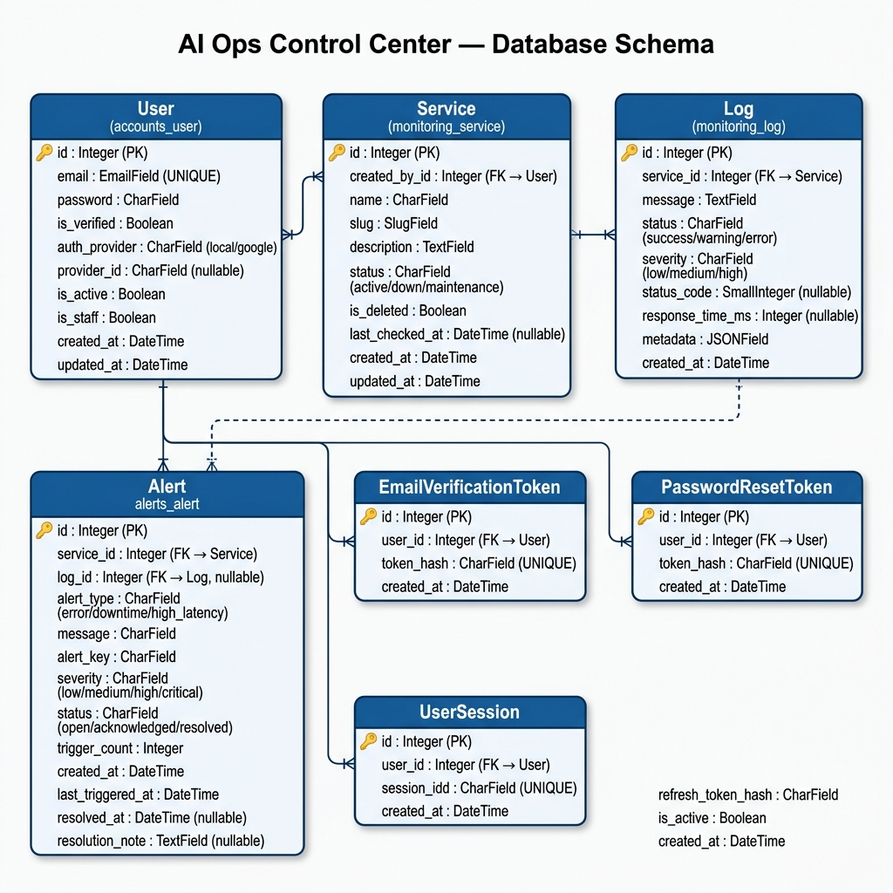

### Request Flow Diagram

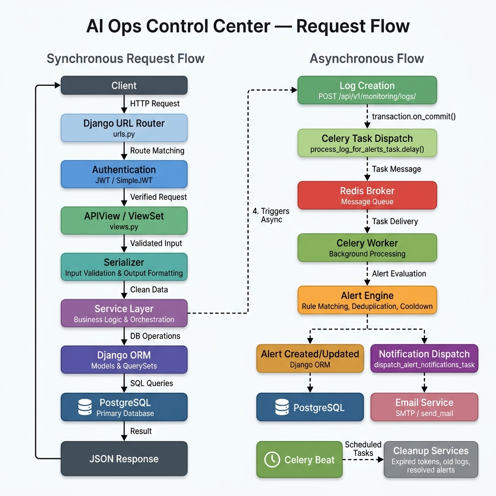

### Request Flow

```
HTTP Request
    │
    ▼
┌────────────────┐
│   Django URL    │ ─── URL routing (/api/v1/...)
│   Router       │
└────────┬───────┘
         │
         ▼
┌────────────────┐
│   Views /      │ ─── Request validation, permission checks
│   ViewSets     │
└────────┬───────┘
         │
         ▼
┌────────────────┐
│  Serializers   │ ─── Input validation, output formatting
└────────┬───────┘
         │
         ▼
┌────────────────┐
│  Service Layer │ ─── Business logic, orchestration
└────────┬───────┘
         │
    ┌────┴─────────────────────┐
    ▼                          ▼
┌────────┐         ┌─────────────────────┐
│ Models │         │  transaction.on_commit()
│  (DB)  │         │         │
└────────┘         │         ▼
                   │  ┌──────────────┐
                   │  │ Celery Task  │ ─── Async alert processing,
                   │  └──────┬───────┘     notification dispatch,
                   │         │             cleanup jobs
                   │         ▼
                   │  ┌──────────────┐
                   │  │    Redis     │ ─── Broker + Result Backend
                   │  │   (Broker)   │
                   │  └──────┬───────┘
                   │         │
                   │         ▼
                   │  ┌──────────────┐
                   │  │Celery Worker │
                   │  └──────┬───────┘
                   │         │
                   │         ▼
                   │  ┌───────────────────┐
                   │  │ Notification Svc  │
                   │  │        ↓          │
                   │  │  Email Service    │
                   │  │        ↓          │
                   │  │  Resend API       │
                   │  └───────────────────┘
                   └─────────────────────┘

Celery Beat ──→ Redis ──→ Celery Worker ──→ Scheduled Cleanup Tasks
```

### Component Responsibilities

| Component | Responsibility |
|-----------|---------------|
| **Views / ViewSets** | HTTP handling, permission enforcement, schema decoration |
| **Serializers** | Input validation, read/write separation, response formatting |
| **Services** | Business logic, DB transactions, token management, orchestration |
| **Models** | Data persistence, constraints, indexes, domain methods |
| **Tasks** | Async processing, retry policies, Celery Beat scheduling |
| **Notification Service** | Provider-isolated notification orchestration |
| **Email Service** | Email delivery via Resend API |
| **Schemas** | OpenAPI documentation decorators with examples |
| **Filters** | `django-filter` backends for query parameter filtering |
| **Pagination** | Cursor-based pagination for time-series data |
| **Throttling** | IP-based rate limiting per endpoint |

---

## ☁️ Deployment

### Railway

AI Ops is deployed to **Railway** as a multi-service application:

| Service | Runtime | Description |
|---------|---------|-------------|
| **Django Web** | Gunicorn | WSGI server binding to `$PORT`, workers configurable via `WEB_CONCURRENCY` |
| **PostgreSQL** | Managed | Railway-provisioned PostgreSQL instance with automatic backups |
| **Redis** | Managed | Message broker and result backend, accessible via Railway's internal private network |
| **Celery Worker** | `celery -A ai_ops worker` | Processes async tasks — alert evaluation, notification dispatch |
| **Celery Beat** | `celery -A ai_ops beat` | Schedules periodic cleanup tasks (accounts, logs, alerts) |

**Infrastructure Details:**

- **Gunicorn** — Production WSGI server with configurable worker count (`WEB_CONCURRENCY`), binds to Railway's `$PORT`
- **PostgreSQL** — Managed Railway instance; connection via `DB_NAME`, `DB_USER`, `DB_PASSWORD`, `DB_HOST`, `DB_PORT` environment variables
- **Redis** — Internal private networking between Django, Celery Worker, and Celery Beat; configured via `CELERY_BROKER_URL` and `CELERY_RESULT_BACKEND`
- **Celery Worker** — Async task processing with exponential backoff retries (max 5), soft time limit 300s, hard time limit 600s
- **Celery Beat** — Periodic scheduler for accounts cleanup (hourly), log retention (daily 3 AM), alert retention (daily 4 AM)
- **WhiteNoise** — `CompressedManifestStaticFilesStorage` serves static files with Gzip/Brotli compression and cache-busting hashes; `collectstatic` runs at Docker build time
- **Resend** — Production email delivery via the `resend` Python SDK; no SMTP server required
- **Health Checks** — Railway monitors the Django service via `GET /api/v1/health/` (unauthenticated)
- **Environment Variables** — All secrets and configuration managed via Railway's environment variable interface

### Docker Compose

For self-hosted deployments, use the provided Docker Compose configurations:

- **Development** — `docker-compose.dev.yml` (Django `runserver`, hot-reload, volume mount)
- **Production** — `docker-compose.prod.yml` (Gunicorn, static/media volumes, restart policies)

---

## 🏆 Production Highlights

- **Gunicorn** WSGI server with configurable concurrency (`WEB_CONCURRENCY`)
- **WhiteNoise** compressed static file serving with cache-busting manifests
- **Celery + Redis** for async task processing and periodic scheduling
- **Resend API** for transactional email delivery — no SMTP dependency
- **`transaction.on_commit()`** ensures Celery tasks execute only after successful DB commits
- **Split settings** (`dev.py` / `prod.py`) with `django-environ` for secret management
- **Security hardening** — HSTS, SSL redirect, secure cookies, CSRF protection, non-root container
- **Health check endpoint** for Docker, Railway, and load balancer probes
- **Alert deduplication** with cooldown windows and row-level locking
- **Retry strategy** with exponential backoff and jitter on all async tasks

---

## 🛠️ Tech Stack

### Backend

| Technology | Version | Purpose |
|------------|---------|---------|
| Python | 3.12+ | Runtime |
| Django | 5.2.1 | Web framework |
| Django REST Framework | 3.16.0 | REST API |
| PostgreSQL | 15+ | Primary database |
| Redis | 8.0.1 | Celery broker & result backend |
| Celery | 5.6.3 | Async task processing |
| Celery Beat | 2.9.0 | Periodic task scheduling (`django-celery-beat`) |
| Gunicorn | 26.0.0 | Production WSGI server |

### Authentication

| Technology | Version | Purpose |
|------------|---------|---------|
| SimpleJWT | 5.5.1 | JWT authentication |
| django-allauth | 65.18.0 | Google OAuth 2.0 |
| google-auth | 2.56.0 | Google ID token verification |
| PyJWT | 2.13.0 | JWT token handling |

### Email & Notifications

| Technology | Version | Purpose |
|------------|---------|---------|
| Resend | 2.34.0 | Production email delivery API |
| django-anymail | 15.0 | Email provider abstraction layer |

### Containerization & Deployment

| Technology | Purpose |
|------------|---------|
| Docker | Production-grade container image (Python 3.13-slim) |
| Docker Compose | Multi-service orchestration (dev & prod) |
| Railway | Cloud deployment platform |
| WhiteNoise | Production static file serving (v6.12.0) |

### Documentation

| Technology | Version | Purpose |
|------------|---------|---------|
| drf-spectacular | 0.29.0 | OpenAPI 3.0 schema generation |
| Swagger UI | — | Interactive API explorer |
| ReDoc | — | Alternative API documentation viewer |

### Libraries & Utilities

| Technology | Version | Purpose |
|------------|---------|---------|
| django-filter | 25.1 | API filtering |
| django-ratelimit | 4.1.0 | Rate limiting |
| django-environ | 0.12.0 | Environment variable management |
| django-extensions | 4.1 | Development utilities |
| psycopg2-binary | 2.9.10 | PostgreSQL adapter |

### Testing

| Technology | Version | Purpose |
|------------|---------|---------|
| pytest | 9.1.1 | Test runner |
| pytest-django | 4.12.0 | Django integration for pytest |
| pytest-cov | 7.1.0 | Coverage plugin for pytest |
| factory_boy | 3.3.3 | Test data factories |
| Faker | 40.36.0 | Realistic fake data generation |
| coverage | 7.15.3 | Code coverage measurement |

---

## 📁 Project Structure

```
ai_ops/
├── ai_ops/                    # Django project configuration
│   ├── settings/
│   │   ├── base.py            # Shared settings (DB, JWT, Celery, logging, email, Resend, WhiteNoise)
│   │   ├── dev.py             # Development overrides (DEBUG, BrowsableAPI, AllowAny)
│   │   └── prod.py            # Production hardening (HSTS, secure cookies, SSL, ALLOWED_HOSTS)
│   ├── celery.py              # Celery application setup
│   ├── urls.py                # Root URL configuration with API versioning
│   ├── wsgi.py                # WSGI entry point
│   └── asgi.py                # ASGI entry point
│
├── accounts/                  # Authentication & user management app
│   ├── models.py              # User, EmailVerificationToken, PasswordResetToken, UserSession
│   ├── managers.py            # Custom UserManager (email-based)
│   ├── views.py               # Auth API views (register, login, verify, reset, Google)
│   ├── services.py            # Auth business logic (service classes)
│   ├── serializers.py         # Request/response serializers
│   ├── tokens.py              # JWT token generation and decoding
│   ├── utils.py               # Token generation, hashing, Resend email sending
│   ├── throttling.py          # Per-endpoint rate limiting
│   ├── tasks.py               # Celery cleanup tasks
│   ├── admin.py               # Custom UserAdmin
│   ├── schemas/
│   │   └── auth_schema.py     # OpenAPI schema decorators
│   └── urls.py                # Auth URL routes
│
├── monitoring/                # Service monitoring, log ingestion & health checks
│   ├── models.py              # Service, Log models with indexes
│   ├── views.py               # LogViewSet (create, list, retrieve), HealthCheckAPIView
│   ├── serializers/
│   │   └── log_serializer.py  # LogWriteSerializer, LogReadSerializer
│   ├── services/
│   │   ├── alert_service.py   # Alert rule engine & alert processing
│   │   ├── cleanup_service.py # Log retention cleanup
│   │   └── health_service.py  # Health check orchestrator (app, DB, Redis, Celery, Beat)
│   ├── filters.py             # Log filtering (status, service, time range, response time)
│   ├── pagination.py          # LogCursorPagination
│   ├── tasks.py               # Celery tasks (alert processing, log cleanup)
│   ├── admin.py               # ServiceAdmin, LogAdmin (read-only)
│   ├── schemas/
│   │   ├── log_schema.py      # OpenAPI schema decorators for logs
│   │   └── health_schema.py   # OpenAPI schema decorators for health check
│   └── urls.py                # Monitoring URL routes
│
├── alerts/                    # Alert management & notification app
│   ├── models.py              # Alert model with lifecycle, constraints, indexes
│   ├── views.py               # AlertViewSet (create, list, retrieve, resolve)
│   ├── serializers/
│   │   └── alert_serializer.py # AlertWrite, AlertRead, AlertResolve serializers
│   ├── services/
│   │   ├── notification_service.py  # Notification orchestrator (provider-isolated dispatch)
│   │   ├── email_service.py         # Resend email delivery
│   │   ├── slack_service.py         # Slack webhook placeholder
│   │   └── cleanup_service.py       # Resolved alert cleanup
│   ├── filters.py             # Alert filtering (status, type, severity, time, trigger count)
│   ├── pagination.py          # AlertCursorPagination
│   ├── tasks.py               # Celery tasks (notification dispatch, alert cleanup)
│   ├── admin.py               # AlertAdmin with bulk lifecycle actions
│   ├── schemas/
│   │   └── alert_schema.py    # OpenAPI schema decorators
│   ├── templates/emails/
│   │   ├── alert_created.html # HTML alert notification template
│   │   └── alert_created.txt  # Plain-text alert notification template
│   └── urls.py                # Alert URL routes
│
├── tests/                     # Comprehensive test suite
│   ├── conftest.py            # Shared fixtures (user, service, log, alert, api_client)
│   ├── factories/             # factory_boy test data factories
│   │   ├── user_factory.py
│   │   ├── service_factory.py
│   │   ├── log_factory.py
│   │   ├── alert_factory.py
│   │   ├── token_factory.py
│   │   ├── session_factory.py
│   │   └── test_factories.py  # Factory self-tests
│   ├── accounts/              # Accounts unit tests
│   │   ├── test_models.py
│   │   ├── test_managers.py
│   │   ├── test_serializers.py
│   │   ├── test_services.py
│   │   ├── test_views.py
│   │   ├── test_tasks.py
│   │   ├── test_tokens.py
│   │   ├── test_urls.py
│   │   └── test_utils.py
│   ├── monitoring/            # Monitoring unit tests
│   │   ├── conftest.py
│   │   ├── test_models.py
│   │   ├── test_serializers.py
│   │   ├── test_views.py
│   │   ├── test_tasks.py
│   │   ├── test_filters.py
│   │   ├── test_pagination.py
│   │   ├── test_urls.py
│   │   ├── test_alert_service.py
│   │   ├── test_cleanup_service.py
│   │   └── test_health_service.py
│   ├── alerts/                # Alerts unit tests
│   │   ├── test_models.py
│   │   ├── test_serializers.py
│   │   ├── test_views.py
│   │   ├── test_tasks.py
│   │   ├── test_filters.py
│   │   ├── test_pagination.py
│   │   ├── test_cleanup_service.py
│   │   ├── test_email_service.py
│   │   └── test_notification_service.py
│   ├── apis/                  # End-to-end API tests
│   │   ├── test_auth.py
│   │   ├── test_logs.py
│   │   ├── test_alerts.py
│   │   └── test_health.py
│   └── integration/           # Integration workflow tests
│       ├── test_login_workflow.py
│       ├── test_email_verification_workflow.py
│       ├── test_password_reset_workflow.py
│       ├── test_log_to_alert.py
│       ├── test_alert_notification.py
│       ├── test_monitoring_pipeline.py
│       ├── test_health_monitoring.py
│       └── test_permission_workflow.py
│
├── templates/
│   └── google_login_test/
│       └── google_test.html   # Google OAuth test page
│
├── docs/
│   ├── api/                   # OpenAPI schema (YAML)
│   ├── architecture/          # Architecture diagrams
│   ├── postman/               # Postman collection
│   ├── screenshots/           # Application screenshots
│   ├── testing/               # Testing screenshots
│   └── testing_reports/       # Pytest & coverage text reports
│
├── Dockerfile                 # Production-grade Docker image
├── docker-compose.dev.yml     # Development Docker Compose stack
├── docker-compose.prod.yml    # Production Docker Compose stack
├── .dockerignore              # Docker build context exclusions
├── manage.py                  # Django management script
├── pytest.ini                 # Pytest configuration
├── requirements.txt           # Python dependencies
├── .env.example               # Environment variable template
├── LICENSE                    # MIT License
├── CONTRIBUTING.md            # Contribution guidelines
├── CHANGELOG.md               # Project changelog
└── .gitignore                 # Git ignore rules
```

---

## 🚀 Installation

### Prerequisites

- Python 3.12+
- PostgreSQL 15+
- Redis 7+

### Step 1 — Clone the Repository

```bash
git clone https://github.com/Him-Anshu26/ai-ops.git
cd ai-ops
```

### Step 2 — Create a Virtual Environment

```bash
python -m venv venv
```

**Activate the virtual environment:**

```bash
# Windows
venv\Scripts\activate

# macOS / Linux
source venv/bin/activate
```

### Step 3 — Install Dependencies

```bash
pip install -r requirements.txt
```

### Step 4 — Configure Environment Variables

```bash
cp .env.example .env.dev
```

Edit `.env.dev` with your local configuration (see [Environment Variables](#-environment-variables) below).

### Step 5 — Run Database Migrations

```bash
python manage.py migrate
```

### Step 6 — Create a Superuser

```bash
python manage.py createsuperuser
```

### Step 7 — Start Redis

```bash
# Docker
docker run -d -p 6379:6379 redis:latest

# Or use your local Redis installation
redis-server
```

### Step 8 — Start the Celery Worker

```bash
celery -A ai_ops worker --loglevel=info
```

### Step 9 — Start Celery Beat

```bash
celery -A ai_ops beat --loglevel=info
```

### Step 10 — Run the Development Server

```bash
python manage.py runserver
```

The API is now available at `http://localhost:8000/api/v1/`.

---

## 🔐 Environment Variables

All secrets and configuration are managed via `django-environ`. Variables are loaded from `.env.dev` (development) or `.env.prod` (production) based on the `DJANGO_SETTINGS_MODULE` setting.

### Core

| Variable | Required | Description | Default | Example |
|----------|:--------:|-------------|---------|---------|
| `SECRET_KEY` | ✅ | Django secret key | — | `your-secret-key` |
| `DEBUG` | ❌ | Enable debug mode | `False` | `True` |
| `ALLOWED_HOSTS` | ✅ (prod) | Comma-separated allowed hosts | — | `api.example.com` |
| `DJANGO_SETTINGS_MODULE` | ❌ | Settings module path | `ai_ops.settings.dev` | `ai_ops.settings.prod` |

### Database

| Variable | Required | Description | Default | Example |
|----------|:--------:|-------------|---------|---------|
| `DB_NAME` | ✅ | PostgreSQL database name | `postgres` | `ai_ops_db` |
| `DB_USER` | ✅ | PostgreSQL username | `postgres` | `postgres` |
| `DB_PASSWORD` | ✅ | PostgreSQL password | — | `your-db-password` |
| `DB_HOST` | ❌ | PostgreSQL host | `localhost` | `db` |
| `DB_PORT` | ❌ | PostgreSQL port | `5432` | `5432` |

### Celery & Redis

| Variable | Required | Description | Default | Example |
|----------|:--------:|-------------|---------|---------|
| `CELERY_BROKER_URL` | ✅ | Redis broker URL | — | `redis://localhost:6379/0` |
| `CELERY_RESULT_BACKEND` | ✅ | Redis result backend URL | — | `redis://localhost:6379/0` |

### Email (Resend)

| Variable | Required | Description | Default | Example |
|----------|:--------:|-------------|---------|---------|
| `EMAIL_PROVIDER` | ✅ | Email provider identifier | `console` | `resend` |
| `RESEND_API_KEY` | ✅ | Resend API key for email delivery | — | `re_xxxxxxxxx` |
| `DEFAULT_FROM_EMAIL` | ✅ | Default sender email address | — | `AI-Ops <onboarding@resend.dev>` |
| `ALERT_EMAIL_RECIPIENTS` | ✅ | Comma-separated alert recipients | — | `admin@example.com` |

### Notifications

| Variable | Required | Description | Default | Example |
|----------|:--------:|-------------|---------|---------|
| `EMAIL_NOTIFICATIONS_ENABLED` | ❌ | Enable email alert notifications | `True` | `True` |
| `SLACK_NOTIFICATIONS_ENABLED` | ❌ | Enable Slack notifications (placeholder) | `False` | `False` |

### OAuth & URLs

| Variable | Required | Description | Default | Example |
|----------|:--------:|-------------|---------|---------|
| `GOOGLE_CLIENT_ID` | ✅ | Google OAuth 2.0 client ID | — | `xxxx.apps.googleusercontent.com` |
| `GOOGLE_CLIENT_SECRET` | ✅ | Google OAuth 2.0 client secret | — | `GOCSPX-xxxx` |
| `FRONTEND_URL` | ❌ | Frontend base URL for email links | `http://localhost:3000` | `https://app.example.com` |
| `BACKEND_URL` | ❌ | Backend base URL | `http://localhost:8000` | `https://api.example.com` |

### Production

| Variable | Required | Description | Default | Example |
|----------|:--------:|-------------|---------|---------|
| `CSRF_TRUSTED_ORIGINS` | ✅ (prod) | Comma-separated trusted origins for CSRF | `https://localhost` | `https://your-domain.com` |
| `WEB_CONCURRENCY` | ❌ | Gunicorn worker count | `4` | `4` |
| `PORT` | ❌ | Port Gunicorn binds to | `8000` | `8000` |

---

## 📮 Postman

You can quickly test the API by importing the provided Postman collection.

- **Collection**: `docs/postman/AI_Ops.postman_collection.json` (Contains every endpoint)

Users only need to change the Base URL and update Tokens in the environment variables.

---

## 📸 Screenshots

### Swagger API Documentation
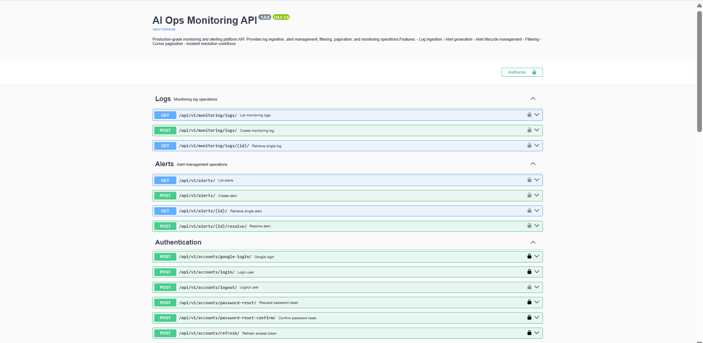
*Interactive API documentation powered by drf-spectacular.*

### User Registration
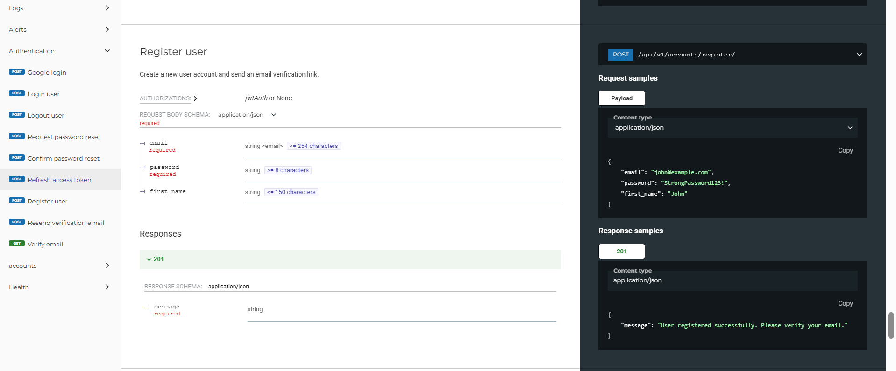
*Endpoint for registering new users with validation.*

### User Login
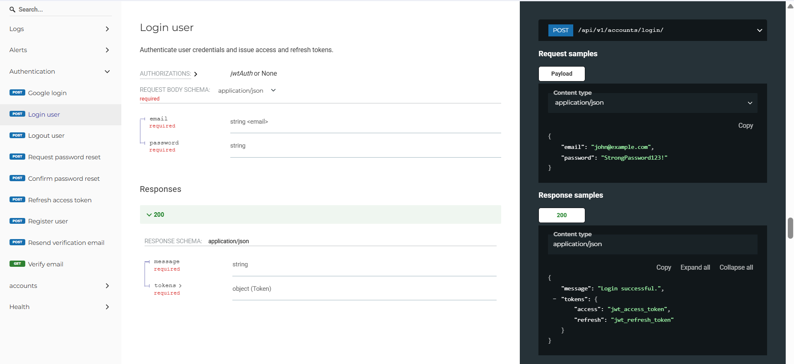
*JWT-based authentication endpoint.*

### Health Check
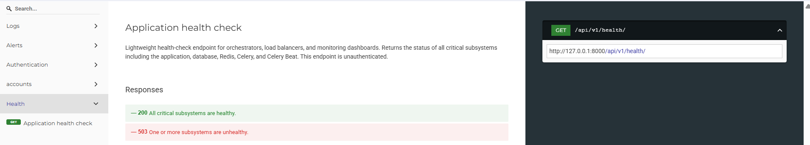
*System health monitoring endpoint.*

### Docker Infrastructure
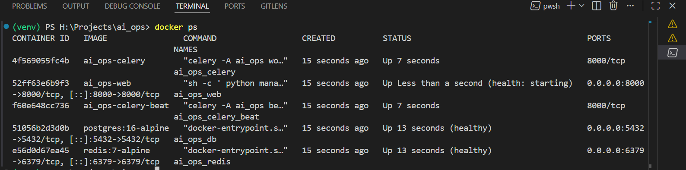
*Containerized services running via Docker Compose.*

### All Tests Passed
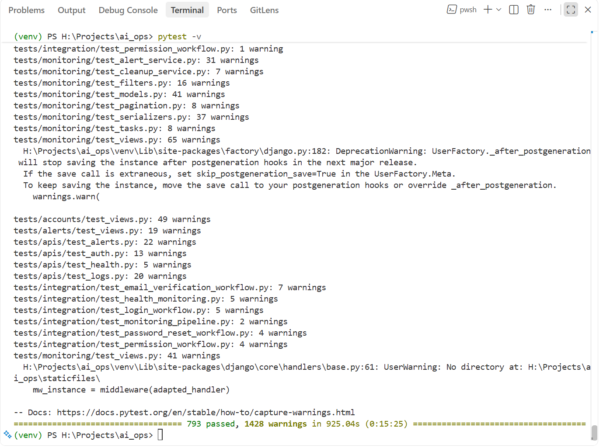
*Full automated test suite passing — unit, API, and integration tests.*

### Code Coverage Report
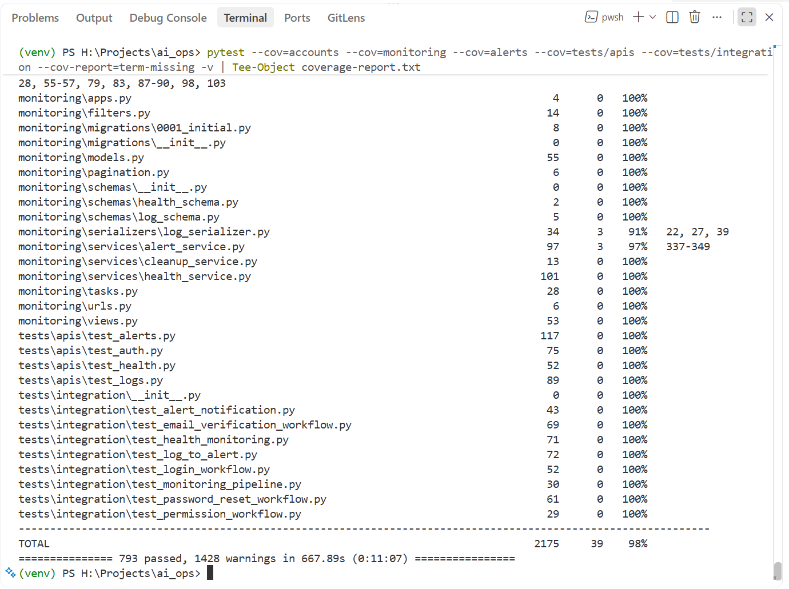
*Code coverage summary across all application modules.*

---

## 📡 API Documentation

The project provides comprehensive API documentation out of the box using:
- **OpenAPI 3**
- **Swagger UI**
- **ReDoc**

### Interactive Documentation

| URL | Interface | Live Link |
|-----|-----------|----------|
| `/api/v1/docs/` | Swagger UI | [Open Swagger](https://ai-ops-production-himanshu26.up.railway.app/api/v1/docs/) |
| `/api/v1/docs/redoc/` | ReDoc | [Open ReDoc](https://ai-ops-production-himanshu26.up.railway.app/api/v1/docs/redoc/) |
| `/api/v1/schema/` | Raw OpenAPI 3.0 JSON schema | [Download Schema](https://ai-ops-production-himanshu26.up.railway.app/api/v1/schema/) |

### API Endpoints

#### Authentication — `/api/v1/accounts/`

| Method | Endpoint | Description |
|--------|----------|-------------|
| `POST` | `/register/` | Register new user account |
| `POST` | `/login/` | Authenticate and receive JWT tokens |
| `GET` | `/verify-email/?token=<token>` | Verify email address |
| `POST` | `/resend-verification/` | Resend verification email |
| `POST` | `/refresh/` | Refresh access token |
| `POST` | `/logout/` | Invalidate current session |
| `POST` | `/password-reset/` | Request password reset email |
| `POST` | `/password-reset-confirm/` | Reset password with token |
| `POST` | `/google-login/` | Authenticate via Google ID token |
| `GET` | `/google-test/` | Google OAuth test page (development) |

#### Monitoring — `/api/v1/monitoring/`

| Method | Endpoint | Description |
|--------|----------|-------------|
| `GET` | `/logs/` | List monitoring logs (paginated, filterable) |
| `POST` | `/logs/` | Create a new monitoring log entry |
| `GET` | `/logs/{id}/` | Retrieve a single log entry |

#### Alerts — `/api/v1/alerts/`

| Method | Endpoint | Description |
|--------|----------|-------------|
| `GET` | `/` | List alerts (paginated, filterable) |
| `POST` | `/` | Create an alert (testing/QA) |
| `GET` | `/{id}/` | Retrieve a single alert |
| `POST` | `/{id}/resolve/` | Resolve an alert with resolution note |

#### Health — `/api/v1/health/`

| Method | Endpoint | Description |
|--------|----------|-------------|
| `GET` | `/` | System health check (unauthenticated) |

#### Documentation — `/api/v1/`

| Method | Endpoint | Description |
|--------|----------|-------------|
| `GET` | `/docs/` | Swagger UI interactive explorer |
| `GET` | `/docs/redoc/` | ReDoc API documentation |
| `GET` | `/schema/` | Raw OpenAPI 3.0 JSON schema |

---

## 🔑 Authentication Flow

### Registration & Email Verification

```
1. POST /api/v1/accounts/register/
   → User created (is_verified=False)
   → Raw token generated (secrets.token_urlsafe)
   → Token SHA-256 hashed before DB storage
   → Verification email sent via Resend API with raw token link
   → Token expires in 24 hours

2. GET /api/v1/accounts/verify-email/?token=<raw_token>
   → Incoming token hashed with SHA-256
   → Hash compared against DB record
   → User marked is_verified=True
   → Token deleted (one-time use)
```

### Login & JWT Lifecycle

```
3. POST /api/v1/accounts/login/
   → Credentials validated (email + password)
   → Email verification enforced
   → Unique session_id generated
   → Access token generated (15 min, contains user_id + session_id)
   → Refresh token generated (7 days, contains user_id + session_id)
   → Refresh token SHA-256 hashed and stored in UserSession
   → Both tokens returned to client

4. POST /api/v1/accounts/refresh/
   → Refresh token JWT decoded and validated
   → Active session lookup by user_id + session_id
   → Incoming refresh token hash compared against DB hash
   → New access token issued (same session_id)

5. POST /api/v1/accounts/logout/
   → session_id extracted from JWT payload
   → UserSession marked is_active=False (soft logout)
   → Session preserved for audit history
```

### Password Reset

```
6. POST /api/v1/accounts/password-reset/
   → Generic response regardless of email existence
   → Reset token generated and hashed (30 min expiry)
   → Reset email sent via Resend API with raw token link

7. POST /api/v1/accounts/password-reset-confirm/
   → Token validated and expiry checked
   → Password updated (hashed)
   → ALL user sessions invalidated
   → Token deleted (one-time use)
```

### Google OAuth 2.0

```
8. POST /api/v1/accounts/google-login/
   → Google ID token verified via google.oauth2.id_token
   → Issuer validated (accounts.google.com)
   → Email verification status checked
   → Existing user found or new user auto-provisioned
   → SocialAccount record created/linked
   → Internal session created with JWT tokens
   → Standard access + refresh tokens returned
```

---

## ⚙️ Background Processing

### Celery Configuration

| Setting | Value |
|---------|-------|
| Broker | Redis |
| Result Backend | Redis |
| Serializer | JSON |
| Soft Time Limit | 300 seconds |
| Hard Time Limit | 600 seconds |
| Broker Connection Retry | On startup |

Alert processing occurs **after successful database commit** via `transaction.on_commit()`, preventing race conditions where Celery workers execute before the transaction is committed.

### Asynchronous Tasks

| Task | App | Trigger | Description |
|------|-----|---------|-------------|
| `process_log_for_alerts_task` | monitoring | On log creation (`transaction.on_commit`) | Evaluates alert rules against new log |
| `dispatch_alert_notifications_task` | alerts | On alert creation/update (`transaction.on_commit`) | Dispatches email notifications via Resend |
| `cleanup_accounts` | accounts | Celery Beat — every hour | Cleans expired tokens and inactive sessions |
| `cleanup_monitoring` | monitoring | Celery Beat — daily at 3:00 AM | Deletes logs older than 120 days |
| `cleanup_alerts_task` | alerts | Celery Beat — daily at 4:00 AM | Deletes resolved alerts older than 90 days |

### Retry Strategy

The `process_log_for_alerts_task` and `dispatch_alert_notifications_task` implement production-grade retry policies:

- **Auto-retry on** — `ConnectionError`, `DatabaseError`
- **Max retries** — 5
- **Backoff** — Exponential with jitter
- **Max backoff** — 300 seconds

---

## 🛡️ Security

| Feature | Implementation |
|---------|----------------|
| JWT Authentication | SimpleJWT with HS256, 15-min access / 7-day refresh |
| Password Hashing | Django PBKDF2 (default) |
| Token Hashing | SHA-256 for all verification, reset, and refresh tokens |
| Refresh Token Validation | Hash comparison against DB-stored session |
| Session Management | DB-tracked sessions with soft logout |
| Email Verification | Mandatory before login, 24-hour token expiry |
| Email Enumeration Prevention | Generic responses on all public auth endpoints |
| Rate Limiting | IP-based via `django-ratelimit` (5-10 req/min per endpoint) |
| Anonymous Throttling | 100 requests/day global via DRF `AnonRateThrottle` |
| Password Validation | Django's built-in validators (similarity, length, common, numeric) |
| CSRF Protection | Django CSRF middleware enabled |
| HSTS | 1-year duration, include subdomains, preload (production) |
| SSL Redirect | Enforced in production |
| Secure Cookies | `SESSION_COOKIE_SECURE` and `CSRF_COOKIE_SECURE` (production) |
| Clickjacking Protection | `X-Frame-Options: DENY` (production) |
| Content Type Sniffing | `SECURE_CONTENT_TYPE_NOSNIFF` (production) |
| Proxy SSL | `SECURE_PROXY_SSL_HEADER` for Railway / reverse proxy support |
| Input Validation | Field-level and object-level serializer validation |
| Split Settings | Separate dev/prod configurations |
| Secret Management | All secrets via environment variables (`django-environ`) |

---

## 🗄️ Database

### Models

#### `accounts` App

| Model | Description |
|-------|-------------|
| **User** | Custom user model; email as primary identifier; `is_verified`, `auth_provider` (`local`/`google`), `provider_id` fields |
| **EmailVerificationToken** | SHA-256 hashed verification tokens with 24-hour expiry |
| **PasswordResetToken** | SHA-256 hashed reset tokens with 30-minute expiry |
| **UserSession** | Tracks active sessions; stores hashed refresh tokens; supports soft logout |

#### `monitoring` App

| Model | Description |
|-------|-------------|
| **Service** | Monitored service with name, slug (auto-generated), status, soft delete; unique per user |
| **Log** | Monitoring log entry with status (`success`/`warning`/`error`), severity, HTTP status code, response time, JSON metadata |

#### `alerts` App

| Model | Description |
|-------|-------------|
| **Alert** | Incident record with type (`error`/`downtime`/`high_latency`), severity, lifecycle status, trigger count, resolution notes |

### Key Relationships

```
User ──┬── EmailVerificationToken (1:N)
       ├── PasswordResetToken (1:N)
       ├── UserSession (1:N)
       └── Service (1:N, via created_by)
                └── Log (1:N)
                      └── Alert (N:1 via log, N:1 via service)
```

### Database Optimizations

- **Composite indexes** on frequently queried field combinations
- **Partial indexes** for active-only queries (e.g., `idx_active_alerts_per_service`)
- **Unique constraints** with conditions to enforce business rules (e.g., one active alert per service + type + key)
- **`select_related`** on all ViewSet querysets to prevent N+1 queries
- **`select_for_update`** for row-level locking in concurrent alert processing

---

## 📦 API Response Format

### Success Response

```json
{
  "message": "Login successful.",
  "tokens": {
    "access": "eyJhbGciOiJIUzI1NiIs...",
    "refresh": "eyJhbGciOiJIUzI1NiIs..."
  }
}
```

### Paginated Response (Cursor)

```json
{
  "next": "http://localhost:8000/api/v1/monitoring/logs/?cursor=cD0yMDI2...",
  "previous": null,
  "results": [
    {
      "id": 1,
      "service": 1,
      "service_name": "Auth Service",
      "status": "error",
      "status_code": 500,
      "response_time_ms": 3200,
      "message": "Database connection failed",
      "created_at": "2026-07-20T10:30:00Z"
    }
  ]
}
```

### Validation Error

```json
{
  "email": [
    "A user with this email already exists."
  ],
  "password": [
    "This password is too common."
  ]
}
```

### Authentication Error

```json
{
  "detail": "Authentication credentials were not provided."
}
```

---

## 🧪 Testing

AI Ops includes a comprehensive automated test suite built with **pytest**, **pytest-django**, and **factory_boy**.

### Testing Architecture

The test suite follows a layered testing strategy:

```
tests/
├── conftest.py            # Shared fixtures (user, service, log, alert, api_client)
├── factories/             # factory_boy test data factories
├── accounts/              # Accounts unit tests (models, services, views, serializers, tasks, etc.)
├── monitoring/            # Monitoring unit tests (models, views, filters, pagination, services, etc.)
├── alerts/                # Alerts unit tests (models, views, filters, pagination, services, etc.)
├── apis/                  # End-to-end API tests (auth, logs, alerts, health)
└── integration/           # Cross-component integration workflow tests
```

| Layer | Purpose | Location |
|-------|---------|----------|
| **Unit Tests** | Test individual components in isolation (models, serializers, services, tasks, filters, pagination, URLs, views) | `tests/accounts/`, `tests/monitoring/`, `tests/alerts/` |
| **API Tests** | Test complete HTTP request/response cycles against all API endpoints | `tests/apis/` |
| **Integration Tests** | Test cross-component workflows end-to-end | `tests/integration/` |
| **Factory Tests** | Validate factory_boy factories produce correct test data | `tests/factories/test_factories.py` |

### Testing Stack

| Tool | Purpose |
|------|---------|
| `pytest` | Test runner with auto-discovery and rich assertion introspection |
| `pytest-django` | Django integration — database access, settings overrides, live server |
| `pytest-cov` | Coverage measurement plugin for pytest |
| `factory_boy` | Declarative test data factories (replaces manual fixture setup) |
| `Faker` | Realistic fake data generation for factory fields |
| `coverage` | Code coverage analysis and reporting |

### Test Data Factories

All test data is generated via `factory_boy` factories located in `tests/factories/`:

| Factory | Model | Key Defaults |
|---------|-------|--------------|
| `UserFactory` | `accounts.User` | Verified, active, `Password@123` |
| `ServiceFactory` | `monitoring.Service` | Active status, auto-generated name |
| `LogFactory` | `monitoring.Log` | Success status, 200 status code, 150ms response |
| `AlertFactory` | `alerts.Alert` | Error type, open status, medium severity |
| `EmailVerificationTokenFactory` | `accounts.EmailVerificationToken` | Sequential token hashes |
| `PasswordResetTokenFactory` | `accounts.PasswordResetToken` | Sequential token hashes |
| `UserSessionFactory` | `accounts.UserSession` | Active session with hashed refresh token |

### Shared Fixtures

Reusable pytest fixtures are centralized in `tests/conftest.py`:

| Fixture | Description |
|---------|-------------|
| `user` | Creates a verified, active user via `UserFactory` |
| `another_user` | Creates a second user for multi-user tests |
| `service` | Creates a monitoring service via `ServiceFactory` |
| `log` | Creates a monitoring log entry via `LogFactory` |
| `alert` | Creates an alert via `AlertFactory` |
| `client` | Django test `Client` instance |
| `api_client` | DRF `APIClient` instance (unauthenticated) |
| `authenticated_user` | Alias for `user` fixture |
| `authenticated_api_client` | DRF `APIClient` with `force_authenticate` |

App-specific fixtures (e.g., `tests/monitoring/conftest.py`) provide additional helpers like URL fixtures and log creation utilities.

### Unit Tests

Each Django app has comprehensive unit tests covering:

**Accounts** (`tests/accounts/`) — 9 test modules:
- `test_models.py` — User, token, and session model behavior
- `test_managers.py` — Custom `UserManager` creation methods
- `test_serializers.py` — Serializer validation and output formatting
- `test_services.py` — Authentication business logic (register, login, verify, reset, Google OAuth)
- `test_views.py` — View layer HTTP responses and error handling
- `test_tasks.py` — Celery cleanup task execution
- `test_tokens.py` — JWT token generation and decoding
- `test_urls.py` — URL routing and resolution
- `test_utils.py` — Token hashing and email sending utilities

**Monitoring** (`tests/monitoring/`) — 11 test modules:
- `test_models.py` — Service and Log model behavior, constraints, indexes
- `test_serializers.py` — Read/write serializer validation
- `test_views.py` — LogViewSet and HealthCheckAPIView responses
- `test_tasks.py` — Celery alert processing and cleanup tasks
- `test_filters.py` — Log filtering (status, service, time range, response time, message search)
- `test_pagination.py` — Cursor-based pagination behavior
- `test_urls.py` — URL routing and resolution
- `test_alert_service.py` — Alert rule engine (error detection, latency detection, deduplication, cooldown)
- `test_cleanup_service.py` — Log retention cleanup logic
- `test_health_service.py` — Health check orchestrator (application, database, Redis, Celery, Beat)

**Alerts** (`tests/alerts/`) — 9 test modules:
- `test_models.py` — Alert model behavior, lifecycle, constraints
- `test_serializers.py` — Read/write/resolve serializer validation
- `test_views.py` — AlertViewSet CRUD and resolve workflow
- `test_tasks.py` — Celery notification dispatch and cleanup tasks
- `test_filters.py` — Alert filtering (status, type, severity, time ranges, trigger count, message)
- `test_pagination.py` — Cursor-based pagination behavior
- `test_cleanup_service.py` — Resolved alert cleanup logic
- `test_email_service.py` — Resend email delivery for alert notifications
- `test_notification_service.py` — Notification orchestrator (provider isolation, feature flags)

### API Tests

End-to-end API tests in `tests/apis/` validate complete HTTP request/response cycles:

| Test Module | Endpoints Tested |
|-------------|------------------|
| `test_auth.py` | Registration, login, email verification, password reset, refresh, logout |
| `test_logs.py` | Log creation, listing, retrieval, filtering, pagination |
| `test_alerts.py` | Alert creation, listing, retrieval, resolve workflow, filtering, pagination |
| `test_health.py` | Health check endpoint responses |

Endpoints are tested for:
- ✔ Authentication and authorization
- ✔ Input validation and error responses
- ✔ Permission enforcement (authenticated vs. unauthenticated)
- ✔ Success and failure cases
- ✔ Pagination and cursor navigation
- ✔ Filtering with query parameters
- ✔ CRUD operations
- ✔ Health endpoint availability

### Integration Tests

Cross-component workflow tests in `tests/integration/` verify end-to-end pipelines:

| Test Module | Workflow |
|-------------|----------|
| `test_login_workflow.py` | Full login flow: credentials → session creation → JWT issuance |
| `test_email_verification_workflow.py` | Registration → token generation → email verification → verified status |
| `test_password_reset_workflow.py` | Reset request → token → password change → session invalidation |
| `test_log_to_alert.py` | Log ingestion → alert rule evaluation → alert creation/deduplication |
| `test_alert_notification.py` | Alert creation → Celery task → notification dispatch (email, Slack) |
| `test_monitoring_pipeline.py` | Monitoring API → Celery pipeline handoff |
| `test_health_monitoring.py` | Health check orchestrator → subsystem verification |
| `test_permission_workflow.py` | Global permission boundaries (authenticated vs. unauthenticated access) |

### Test Commands

```bash
# Run all tests
pytest -v

# Run accounts tests
pytest tests/accounts/ -v

# Run monitoring tests
pytest tests/monitoring/ -v

# Run alerts tests
pytest tests/alerts/ -v

# Run API tests
pytest tests/apis/ -v

# Run integration tests
pytest tests/integration/ -v

# Run factory tests
pytest tests/factories/ -v

# Run tests with coverage
pytest --cov=accounts --cov=monitoring --cov=alerts -v

# Generate HTML coverage report
pytest --cov=accounts --cov=monitoring --cov=alerts --cov-report=html -v

# Generate terminal coverage report
pytest --cov=accounts --cov=monitoring --cov=alerts --cov-report=term-missing -v
```

### Pytest Configuration

The project uses `pytest.ini` for test configuration:

```ini
[pytest]
DJANGO_SETTINGS_MODULE = ai_ops.settings.dev
python_files = tests.py test_*.py *_tests.py
python_classes = Test*
python_functions = test_*
```

### Test Reports & Evidence

Test execution evidence is preserved in the `docs/` directory:

**`docs/testing_reports/`** — Text-based test and coverage reports:

| Report | Contents |
|--------|---------|
| `accounts-unit-test.txt` | Accounts unit test execution output |
| `monitoring-unit-test.txt` | Monitoring unit test execution output |
| `alerts-unit-test.txt` | Alerts unit test execution output |
| `api-tests-reports.txt` | API test execution output |
| `integration-tests-report.txt` | Integration test execution output |
| `coverage-report.txt` | Full coverage report with line-by-line analysis |

**`docs/testing/`** — Screenshots demonstrating successful test execution:

| Screenshot | Evidence |
|------------|----------|
| `all_tests_passed.png` | Full test suite passing |
| `accounts_unit_test_part1.png`, `part2.png` | Accounts unit test results |
| `monitoring_unit_test_part1.png`, `part2.png` | Monitoring unit test results |
| `alerts_unit_test_part1.png`, `part2.png` | Alerts unit test results |
| `api_tests_part1.png`, `part2.png` | API test results |
| `integration_tests_passed_part1.png`, `part2.png` | Integration test results |
| `coverage_report_01.png` – `06.png` | Coverage report screenshots |
| `pytest-installed.png` | pytest installation verification |
| `factory-boy-installed.png` | factory_boy installation verification |
| `factoryboy-tests-passed.png` | Factory test results |
| `fixtures-loaded.png` | Shared fixture loading verification |
| `testing-directory-structure.png` | Test directory structure |
| `pytest-initial-run.png` | Initial pytest configuration run |

---

## 🏭 Production Readiness

The following production practices are already implemented:

| Practice | Status |
|----------|:------:|
| Service layer architecture | ✅ |
| Read/write serializer separation | ✅ |
| Cursor-based pagination | ✅ |
| Advanced filtering (django-filter) | ✅ |
| JWT authentication (SimpleJWT) | ✅ |
| OAuth 2.0 (Google) | ✅ |
| Background task processing (Celery) | ✅ |
| Periodic task scheduling (Celery Beat) | ✅ |
| Redis broker & result backend | ✅ |
| Resend email delivery | ✅ |
| Asynchronous notification system | ✅ |
| Rate limiting (per-endpoint) | ✅ |
| Environment variable management | ✅ |
| Split dev/prod settings | ✅ |
| Production security hardening (HSTS, SSL, secure cookies) | ✅ |
| Structured logging | ✅ |
| WhiteNoise static file serving | ✅ |
| Database indexing & constraints | ✅ |
| N+1 query prevention | ✅ |
| Transaction safety (`atomic`, `on_commit`) | ✅ |
| Race condition handling (row locking, IntegrityError recovery) | ✅ |
| Alert deduplication & cooldown | ✅ |
| Retry strategy with exponential backoff | ✅ |
| Data retention & cleanup automation | ✅ |
| OpenAPI 3.0 documentation | ✅ |
| HTML email templates | ✅ |
| Custom Django admin interface | ✅ |
| Dockerized development environment | ✅ |
| Dockerized production environment | ✅ |
| Production-grade Dockerfile | ✅ |
| Docker health checks | ✅ |
| Health check API endpoint | ✅ |
| Gunicorn production server | ✅ |
| Railway cloud deployment | ✅ |
| Comprehensive pytest test suite | ✅ |
| factory_boy test data factories | ✅ |
| Unit / API / Integration tests | ✅ |
| Code coverage reporting | ✅ |

---

## 🤝 Contributing

Contributions are welcome! Please follow these guidelines:

1. **Fork** the repository.
2. **Create a feature branch** from `main`:
   ```bash
   git checkout -b feature/your-feature-name
   ```
3. **Follow existing patterns** — service layer, serializer separation, schema decorators.
4. **Write clear commit messages** — use conventional commits where possible.
5. **Add or update OpenAPI schemas** for any new endpoints.
6. **Write tests** — add unit tests for new services and models, API tests for new endpoints.
7. **Run the test suite** — ensure all tests pass before submitting:
   ```bash
   pytest -v
   ```
8. **Submit a Pull Request** with a clear description of the changes.

### Code Style

- Follow PEP 8 conventions.
- Use type hints in service layer functions.
- Keep views thin — delegate business logic to services.
- Use `transaction.atomic()` for multi-step database operations.
- Use `transaction.on_commit()` for Celery task dispatch.

---

## 📄 License

This project is licensed under the **MIT License** — see the [LICENSE](LICENSE) file for details.

Copyright © 2026 Himanshu Shekhar Das

---

## 👤 Maintainer

| Field | Details |
|-------|---------|
| **Name** | Himanshu Shekhar Das |
| **GitHub** | [@Him-Anshu26](https://github.com/Him-Anshu26) |
| **LinkedIn** | [Himanshu Sh. Das](https://linkedin.com/in/himanshu-sh-das) |
| **Email** | hsdhimanshu41@gmail.com |

---

<div align="center">

**Built with Django REST Framework** · **Deployed on Railway** · **Designed for Production**

</div>
